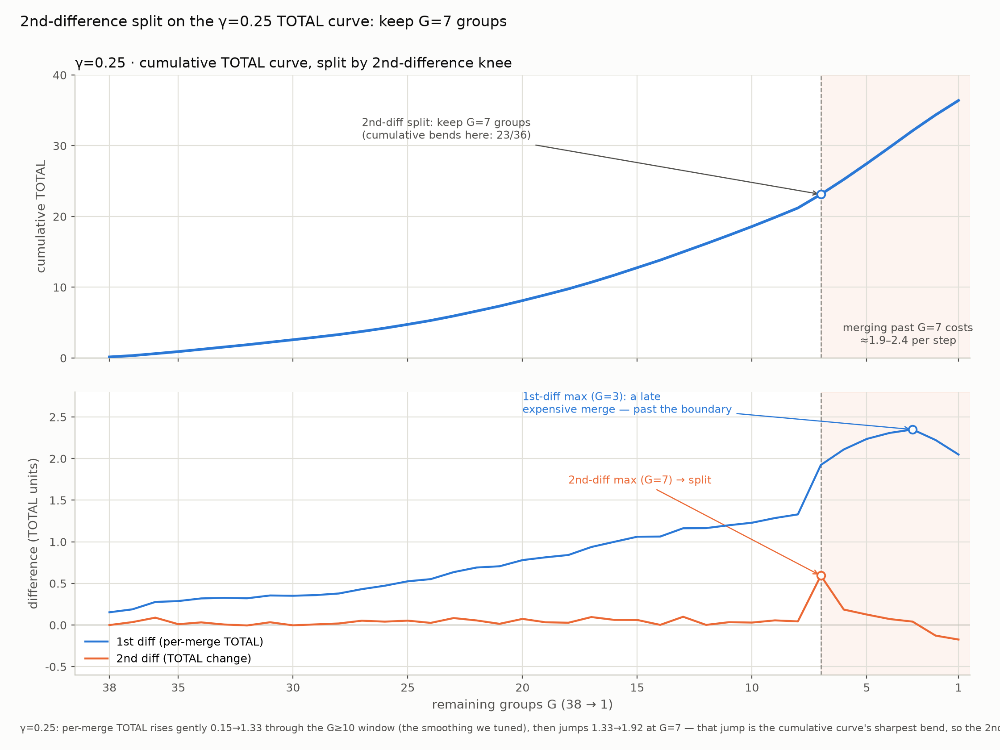

# Hawk-GR

复现 **OneRetrieval / KAE**（快手电商生成式检索，见 `claude/KAE.pdf`）的商品召回链路：

```
query 文本 ──► querySID ──► itemSID(候选) ──► item 列表
            DictEncoder    BART Router      T 表回表
            (AC 词典+码本)  (ONNX beam)      (SID→商品)
```

Java（Spring Boot + ONNX Runtime）提供在线检索服务与 REST API，React 前端提供检索/运营页面，
核心思路：把「query 属性和商品属性」编码成8槽位离散 SID，用 BART 学 query SID → item SID 的路由，再由 SID 倒排表 T 精确/通配回表。

---

## 1. 检索流水线

```
                 ┌─────────────── DictEncoder (Aho-Corasick) ──────────────┐
  "白色跑步鞋" ──►│ 扫 10w+ 属性词 → 按 8 个语义组归位 → 每组取最小 index    │──► querySID
                 │ <a_1609><b_0><c_0><d_0><e_712><f_0><g_0><h_0>  (0=未指定) │
                 └────────────────────────────────────────────────────────┘
                                          │
                       ┌────────────────── BART Router (ONNX) ──────────────┐
                       │ encoder(querySID) → decoder beam search → itemSID  │──► 候选 itemSID ×k
                       │ 例: <a_1609><b_673><c_1051><d_0>…<h_146>            │
                       └────────────────────────────────────────────────────┘
                                          │
                       ┌────────────────── T 索引 (sid_to_items.json) ──────┐
                       │ 精确回表: 候选 SID 逐字命中 → 该 SID 全部商品        │──► item 列表
                       │ 通配回表: 0 视作通配，命中即召回（项目真语义）        │
                       └────────────────────────────────────────────────────┘
```

在线 `searchDebug` 走的是 **masked-wildcard（项目真语义）**：
1. `query_sid` 自身作为通配模式（0=通配）直查 T，命中商品排最前；
2. BART beam 候选 itemSID 逐条在 query 为 0 的位置归 0 → 当通配模式查 T，全局去重追加；
3. 结果列表截断至 `MAX_RESULTS=500`。

论文口径（精确回表）则是：候选 SID **逐字精确**查 T，每个 SID 物化前若干商品，按 beam 序拼接。
两种语义的差异见 [§2 评估](#2-召回评估)。

---

## 2. 召回评估

> 本节整合 `recall_eval_report.md`（日期 2026-09-06）。

### 2.1 item 粒度 HR@10/100/350

**Order**

| Order HR@K | BM25 | docT5query | DPR(向量) | 论文 OneRetrieval | 本模型 item_pop5 | 本模型 sid |
|---|---|---|---|---|---|---|
| @10 | 0.0344 | 0.0423 | 0.0612 | 0.1846 | **0.2060** | 0.2672 |
| @100 | 0.1230 | 0.1640 | 0.2605 | 0.4225 | **0.4650** | 0.5056 |
| @350 | 0.2215 | 0.2926 | 0.4346 | 0.5482 | **0.5670** | 0.6204 |

**Click**

| Click HR@K | BM25 | docT5query | DPR(向量) | 论文 OneRetrieval | 本模型 item_pop5 | 本模型 sid |
|---|---|---|---|---|---|---|
| @10 | 0.0583 | 0.0754 | 0.0956 | 0.2034 | 0.1514 | 0.2130 |
| @100 | 0.1798 | 0.2314 | 0.3340 | 0.4602 | 0.3530 | 0.4342 |
| @350 | 0.2914 | 0.3699 | 0.5027 | 0.6055 | 0.4512 | 0.5496 |

要点：
- **Order**：本模型 item_pop5 在三档全部最高——超 BM25 5.9×/3.8×/2.6×、超 DPR 3.4×/1.8×/1.3×，
  并高出论文 OneRetrieval 2.1/4.3/1.9pt（sid 级更高）。侧向印证路由与码本有效。
- **Click**：明显强于 BM25/docT5query，但 @350 略低于 DPR（0.451 vs 0.503）、低于论文 OR 约 15pt；
  sid 级到 0.550。深度不足主要来自 top-5 物化在拥挤 click SID 上的损失。

### 2.2 为什么 click 表现差（失败归因）

**决定性证据：click 差的根源不在解码、不在 top-5 物化，而在测试目标本身的性质。**

click 组里仅 6% 的「强」目标表现优于 order；拖垮整体的是那 94% 纯 click 商品——被点过却从不转化，
在全量交互里几乎没有统计足迹，查询属性→商品 SID 的共现信号极弱。

---

## 3. 核心概念

### 3.1 8 槽位 SID

SID 形如 `<a_1609><b_673><c_1051><d_0><e_0><f_0><g_0><h_0>`，固定 8 位、每位置一个离散码，
`0` 表示「未指定/无该属性」（query 与 item 都可稀疏）。

| 位置 | 语义组 | sid_max（核心码上限）| 码本条目数* |
|---|---|---|---|
| a | 核心品类 | 2189 | 8816 |
| b | 适用人群与场景 | 1330 | 3289 |
| c | 外观风格 | 2099 | 4950 |
| d | 功能与规格 | 1582 | 8022 |
| e | 材质与修饰 | 1030 | 2419 |
| f | 品牌与工艺 | 563 | 4723 |
| g | 型号与参数 | 264 | 2363 |
| h | 实体与杂项 | 151 | 1366 |

来源：`src/main/resources/kae/kae_config.json` 与 `codebook_{a..h}.json`（词 → index）。
\* 为码本文件条目数（原始值；`KaeConfig.cleanCodebook` 加载时会过滤单字母/纯符号噪声词）。

### 3.2 码本合并依据（关键词组合并阶段）

上面 a–h 这 8 组不是手工拍的：先把属性词按 NER 前缀归到 **39 个属性类别**，再对这 39 个类别做
**贪心合并**（对应论文 §3.3），直到累计代价曲线的拐点。这一步的全部判定公式、分量定义与推导
记录在 [`data/merge_formula.md`](data/merge_formula.md)，本节是它的提要。

**合并判定公式**（对每个候选组对 g_a, g_b，cost 最小者先合并）：

```
cost(g_a, g_b) = IL(g_a, g_b)                    ← 信息损失
              + α·|H(g_a) − H(g_b)|              ← 熵同质性
              + β·|p(g_a) − p(g_b)|              ← 激活率同质性
              + γ·1[family(g_a) ≠ family(g_b)]   ← 语义一致性（跨族=1）
              + δ·1[|g_a| + |g_b| > 6]           ← 组大小软上限（超 6=1）
```

| 项 | 定义 | 要点 |
|---|---|---|
| `IL(g_a, g_b)` | `½(H(g_a)+H(g_b)) − MI(g_a,g_b)` | **组级**信息损失：把整个组当作一个二元变量（商品是否含该组任一类）。论文 §3.3 用的是「类别对平均 IL」，两者在组内含多类别时数值不同——本项目按组级实现，可逐行复现 trace |
| `p(g)` | **并集**激活率 `P(商品含 g 中任一类)` | 不是各类求和：两类可在同一商品上同现（如「金属工艺」同时含 工艺 + 材质_金属材质）|
| `H(g)` | `H(p(g))`，二元熵 | 与 `IL` 一起决定「多相似的组才值得并」|
| `family(g)` | 11 个语义家族（如 款式_、材质_、尺寸规格_）| 跨族合并罚 γ，防止语义漂移 |
| `cap` | `1[|g_a| + |g_b| > 6]` | 软上限：只惩罚、不阻止，避免单组吃掉太多类别 |

**为什么停在 8 组**：锚点组 `产品_核心产品` 单独 hold out、永不参与合并，其余 38 类做
38 步合并到 1 组。合并的每步代价一路平缓，过某点后陡增——于是用累计 TOTAL 曲线的
**二阶差分拐点**（2nd-difference knee）定停止点。γ=0.25 这条曲线上保留 **G=7** 组
（32 次合并、累计代价 23.13），再往下合每步要多付约 1.9–2.4；**7 组 + 1 个锚点 = 上表的 8 组 a–h**。



7 组各自并入了哪些类别（合并结果落盘在 `data/codebook_7groups.json`）：

| 组 | 语义 | 并入的属性类别 | 类别数 |
|---|---|---|---|
| a | 核心品类 | 产品_核心产品（锚点，不参与合并）| 1 |
| b | 适用人群与场景 | 适用范围_适用场景、适用季节、适用对象 | 3 |
| c | 外观风格 | 修饰_外观描述、款式_其他、款式_厚薄、颜色_色彩、风格 | 5 |
| d | 功能与规格 | 修饰_产品属性、功能功效、尺寸规格_售卖规格、尺寸规格_外观尺寸 | 4 |
| e | 材质与修饰 | 产品_修饰产品、产品_其他、修饰_其他、材质_金属材质、材质_面料、适用范围_适用人群 | 6 |
| f | 品牌与工艺 | 品牌、工艺、材质_其他、款式_袖型、款式_领型、颜色_其他 | 6 |
| g | 型号与参数 | 型号、尺寸规格_其他、尺寸规格_指标参数、尺寸规格_重量、系列、适用范围_其他 | 6 |
| h | 实体与杂项 | 人名_真实人名、使用方法_其他、修饰_口味、修饰_工作方式、地点地域_产地、地点地域_其他、文化作品_书名、材质_木质材质、组织机构 | 9 |

参数：α=β=δ=1、cap 阈值 6、**γ=0.25**（即上图这条曲线）。分完组之后，`data/slot_allocation.json`
再按属性词密度把这 8 组切核心码位——9216 个核心槽按密度比例分配，组内 `(V−1)/2` 个头词各自独占
一槽、其余尾词按质心聚簇，每组另留 30 个 reserved 槽（见 §3.3）。该文件里的 `V−1` 就是上表的
`sid_max`（a=2189、b=1330、c=2099、d=1582、e=1030、f=563、g=264、h=151），`n_words` 则是
「码本条目数」列。

### 3.3 保留槽（reserved slot）

每个位置保留 `sid_max+1 … sid_max+30`（共 30 个 / 位置、全站 240 个）为 **reserved 槽**，
训练时不绑词，上线后可把新趋势词注入到某个 reserved 槽并绑定商品集合——**不重训模型即可生效**
（`/api/reserved-bind`，对应论文 §3.2/§3.4.4 的 P1/P2/P3）。每位置 30 个 reserved 槽来自
`data/slot_allocation.json` 的分配结果，见 §3.2。

### 3.4 T 索引

`sid_to_items.json`：SID → 商品 id 列表（约 **315k 行 / 445k 商品**）。
`items_with_sid.json`：商品 → 标题/品牌/卖家/类目/itemSID。

---

## 4. 系统环境要求

| 组件 | 要求 | 本机实测 |
|---|---|---|
| 操作系统 | Linux / macOS；Windows 建议 WSL2 | Ubuntu 24.04.1 LTS（WSL2，kernel 5.15）|
| JDK | **17**（`pom.xml` 固定 `maven.compiler.release=17`）| OpenJDK 17.0.20 |
| Maven | 3.6+（Spring Boot 3.4 要求）| 3.8.7 |
| Node.js | 18+（Vite 5 要求）| v22.23.2 |
| npm | 9+ | 10.9.8 |
| GPU | 可选，非必需 | 无（纯 CPU）|

**Java 依赖**（`pom.xml` 自动拉取）：Spring Boot 3.4.0、ONNX Runtime **GPU** 1.26.0
（无 GPU 时 `OnnxUtils` 自动回退 CPU）、DJL HuggingFace tokenizers 0.36.0、Gson 2.11.0、JLine 3.26.3。

**GPU（可选）**：有 NVIDIA GPU + CUDA 12 时，把 CUDA 12 运行库放到项目根的 `lib/cuda12/`，
`OnnxUtils` 启动时自动预加载并优先使用 CUDA，找不到则打印提示并回退 CPU——**无需手动配置
`LD_LIBRARY_PATH`**。本机无 GPU，全部评估在 CPU 上完成（`OMP_NUM_THREADS=8`）。

**网络**：首次构建需联网（Maven 依赖、`npm install`）；模型权重与 T 索引**不入库**，
首次运行 `./run.sh` 会自动从 GitHub Releases 下载（约 875 MB，见 §5），前端产物缺失时也会
自动 `npm ci + npm run build`（见 §6）。

## 5. 获取模型与索引

权重与索引**不在仓库里**：单个 `.onnx` 就有 344 MB / 576 MB，远超 GitHub 的 100 MB 单文件硬上限
（想入库只能走 git-lfs，而 LFS 免费额度只有 1 GB 存储 + 1 GB/月下行，且**下载者消耗的是你的额度**，
公开项目很快会被限流）；塞进 git 也会让每次 clone 都付出代价。它们以 **GitHub Releases 资产**分发：

| Release 资产 | 内容 | 大小 |
|---|---|---|
| `hawk-gr-model-stage3.tar.gz` | `model/{tokenizer.json, bart_encoder.onnx, bart_decoder.onnx}` | 846 MB |
| `hawk-gr-index.tar.gz` | `src/main/resources/{sid_to_items.json, items_with_sid.json}` | 29 MB |

一键拉取（断点续传 + sha256 校验，文件已就位则整包跳过）：

```bash
scripts/fetch_assets.sh            # = model index
scripts/fetch_assets.sh model      # 只取权重
scripts/fetch_assets.sh index      # 只取 T 索引 / 商品明细
FORCE=1 scripts/fetch_assets.sh    # 已存在也重新解压覆盖
```

> `./run.sh` 启动前会自动做同样的检查（见 §6）：缺哪个补哪个，**拉取失败直接拒绝启动**而不是让应用
> 死在缺文件上。离线、或正要重建索引时用 `HAWK_GR_SKIP_ASSETS=1` 跳过检查。只有默认的 `model/`
> 目录会被自动补齐；`BART_MODEL_DIR` 指向别处时不予干涉。

也可以手动下载两个 `.tar.gz`，在仓库根目录 `tar -xzf` —— 包内是相对路径，解压即落位：

| 落地路径 | 大小 | 用途 |
|---|---|---|
| `model/tokenizer.json` | 2.7 MB | DJL HuggingFace tokenizer |
| `model/bart_encoder.onnx` | 344 MB | BART encoder |
| `model/bart_decoder.onnx` | 576 MB | BART decoder（beam search）|
| `src/main/resources/sid_to_items.json` | 21 MB | T 索引（SID → 商品 id）|
| `src/main/resources/items_with_sid.json` | 79 MB | 商品明细 + itemSID |

- `BART_MODEL_DIR=<dir>` 可指向其他权重目录（默认 `model/`），`BartONNXInference` 只读该目录下
  这三个文件。
- `src/main/resources/ner_model/`（408 MB）**已废弃、无需下载**：NER 已被 Aho-Corasick 词典取代，
  全仓已无代码引用。
- 需要自己发布一份时：`scripts/pack_assets.sh` 生成 `dist/*.tar.gz` + `SHA256SUMS`，
  把这两个（tarball + SHA256SUMS）上传到 Release（tag 默认 `assets-v1`，用 `HAWK_GR_TAG` 覆盖），
  再把 `scripts/assets.sha256` 提交进仓库 —— `fetch_assets.sh` 就靠它对下载做校验。

---

## 6. 快速开始

```bash
# 1) 一条命令拉起后端 + 页面
#    run.sh 依次做：mvn 编译 → 缺权重/索引则自动下载（§5）→ 缺页面则 npm ci + npm run build
./run.sh                                  # = hawk.gr.web.Application，http://localhost:8080
                                          # （首次加载 AC 自动机 + BART ONNX + 两个大 JSON，约 20 秒）
./stop.sh                                 # 停止：等 :8080 真正释放后才返回

# 2) 前端开发（改 UI 时代码热更，页面在 :5173，/api 由 Vite 代理到 :8080）
cd frontend && npm run dev                # 前台进程，Ctrl-C 停止（stop.sh 不碰 node）

# 3) 指向其他权重目录（默认 model/，见 §5）
BART_MODEL_DIR=/path/to/weights ./run.sh

# 4) 命令行工具
./run.sh hawk.gr.HawkSearch               # 交互式检索
./run.sh hawk.gr.ItemSidBuilder           # 批量建 items_with_sid.json + T
./run.sh hawk.gr.RebuildSids              # 重建 SID 索引

# 5) 跳过启动前的检查
HAWK_GR_SKIP_ASSETS=1 ./run.sh            # 离线 / 正在重建索引
HAWK_GR_SKIP_FRONTEND=1 ./run.sh          # 只要 API，不要页面
```

> `run.sh` **只在页面缺失时才构建前端**，改了 UI 源码后要自己重跑 `cd frontend && npm run build`
> （构建产物 `src/main/resources/static/` 不入库，由 `mvn compile` 拷进 `target/classes` 后由
> Spring Boot 在 :8080 单服务托管）。

前端页面（`frontend/src/App.jsx` 四个 tab）：

| Tab | 组件 | 用途 |
|---|---|---|
| 检索 | `SearchBar` + `DebugPanel` + `ResultList` + `RouteEditor` | query 检索、debug 面板、手动编辑 querySID 路由 |
| 注入新词 | `PublishPage` | reserved-slot 预览/注入/绑定/删除（替代旧「手改 SID 槽」方案）|
| 坑位排序 | `SlotManager` | keyword + rank → 指定 item_id 置顶 |
| 查词表 | `SidSearchPage` | SID ↔ 词表双向查询 |

---

## 7. 已知限制与注意事项

- **解码无槽位约束**：BART beam 未加 validity 约束，实测约 **0.36%** 候选 SID 畸形（槽位错乱/
  重复码）。解法的形态是「固定槽位 FSM 硬掩码」（每步只允许对应位置的连续 id band），
  成本近似为零；`querySID` 本身还可进一步做「只在有效商品码集合内」的约束。
- **大 beam 的显存/内存**：CPU 批量路由时活跃行数 `R ≈ chunk × beam`，需保持 `R ≤ ~640`
  （beam20 用 chunk≤32、beam40/50 用 chunk≤12），否则约 14GB RSS 触发 OOM。
- **click 目标噪声**：见 §2.2，纯 click 商品无转化信号，不应作为检索优化目标。
- **全量规模**：当前 `sid_to_items.json` 约 315k 行；全量级重建见 `indexer/BuildFullIndex`。
- **reserved 槽**：每位置 30 个，注入后走前缀匹配 + 绑定集合的确定性命道路径（跳过 BART）。

---

## 8. 论文对照

| 论文（OneRetrieval/KAE） | 本项目 |
|---|---|
| §3.2 码本 / reserved slot | `kae_config.json` + `codebook_{a..h}.json`，每位置 30 reserved 槽 |
| §3.3 贪心合并 + 正则器 | [`data/merge_formula.md`](data/merge_formula.md) + 拐点图，39 类贪心合并到 7 组 + 1 锚点（见 §3.2）；组级 IL 定义与论文略有差异，已记录 |
| §3.4.4 reserved 注入 | `/api/reserved-bind`（运行时注册 + 编码后覆写，不重训）|
| 生成式检索（beam 512 + top-5 物化）| 按该协议离线评估（见 §2）；本机小规模用 beam10/20/50 |
| 8 组 ECOM 属性 | a–h 八组，见 §3.1 |

参考：`claude/KAE.pdf`、`recall_eval_report.md`、[`data/merge_formula.md`](data/merge_formula.md)、
[`thread.md`](thread.md)（复现工作复盘：实体合并 → 槽设计 → 四阶 SFT → AC 自动机）。
